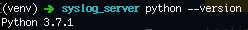

# Actualizar el entorno virtual de tu aplicación de Python 3.6 a 3.7
Autor: Claudio Rivas

Fecha: 10 de noviembre de 2018
## Aviso de exclusión de garantías y responsabilidad 

*La información provista en este documento no constituye una responsabilidad para el autor ni para los entes mencionados, por lo cual deberá ser utilizado a discreción del lector bajo su propio riesgo.
La utilización de plataformas en la nube generalmente implica un costo, por lo cual es necesario revisar dichos costos con los proveedores de servicios, los cuales por ninguna razón son transferibles al autor.*

## Sugerencia

Sigue las actividades de la tabla de contenido, están puestas en orden para realizar toda la configuración de manera ordenada.

## ¿Por qué actualizar?
El soporte a las aplicaciones permite que estas tengan un **ciclo de vida** mas largo, permitiendo así a las personas que realizaron las inversiones en nuestras aplicaciones (en ocasiones nosotros mismos) hacerlas mas redituables extendiendo el ciclo de vida por mas tiempo. Una razón para actualizar es eliminar o reducir **bugs y vulnerabilidades** de nuestros sistemas que son **herencia de errores** o **deuda técnica** propia de la plataforma, esta es una gran justificación técnica para realizar una actualización y recuperar el sueño ¿No lo crees?

Una de las actividades para dar mantenimiento a nuestras aplicaciones en Python es la actualización de versiones de las librerías y componentes así como del mismo intérprete Python que estamos utilizando. En octubre de 2018 se liberó la actualización de Python 3.7.1 con algunas mejoras, por lo cual comencé a actualizar mis aplicaciones a dicha versión, me encontré con algunas dificultades que me encuentro deudo a explicar y compartir para evitar algunos atorones a otros desarrolladores.

## Entornos virtuales
Si estás aquí seguramente ya sabes que varias versiones de Python pueden estar corriendo en tu equipo y convivir sin mayor problema ademas que puedes especificar un entorno virtual que utilice una versión en particular, y versiones de librerías específicas para tu aplicación. De lo contrario te aconsejo primero entender los **entornos virtuales** mediante este video de Youtube y la documentación de entornos virtuales de Python.

[https://realpython.com/python-virtual-environments-a-primer/](https://realpython.com/python-virtual-environments-a-primer/)

[https://www.youtube.com/watch?v=DJfi11z6hTg](https://www.youtube.com/watch?v=DJfi11z6hTg)

## Instala Python 3.7
Descarga la instalación de Python 3.7 según corresponda a tu sistema operativo e instálala con el step by step al abrir el paquete, te dejo la liga.
[https://www.python.org/downloads/](https://www.python.org/downloads/)

## Actualizando el entorno virtual
Primero y muy importante, con tu **entorno virtual** corriendo en la versión que tienes actualmente hay que extraer todas las librerías que estás utilizando actualmente y guardarlas en un archivo **requirements.txt**, para esto ejecuta el siguiente comando:

```
(venv) ➜ pip3 freeze > requirements.txt
```

Con ello generarás el fichero de **requirements.txt** el cual contiene todas las librerías que  tu programa está utilizando actualmente.

Ahora sal del **entorno virtual**, para ello puedes utilizar

```
deactivate
```
Una vez desactivado el entorno virtual borra la carpeta (en mi caso es venv) del entorno virtual actual, para ello puedes utilizar en OSX el comando

```
rm -r venv
```

Cuando ya no tengas la carpeta vamos a actualizar **PIP**, para que las librerías que utilicemos ahora sean las mas vigentes también

```
pip install --upgrade pip
```

ó

```
pip3 install --upgrade pip
```
Verifica que tu versión de Python sea 3.7

```
python3 --version
Python 3.7.1
```

Con esto podemos ahora si regenerar el **entorno virtual** con elcomando:

```
python3 -m venv venv
```
Al generar un nuevo **entorno virtual** en blanco, sin ninguna librería instalada, por supuesto que hay que activarlo para reinstalar las librerías:

```
source venv/bin/activate
```
Si verificas la versión de Python con el comando:

```
python --version
```
deberás ver un resultado similar a este:


Verificar que **PIP** está actualizado es una buena idea:

```
pip3 install --upgrade pip 
```

Una vez activo podemos instalar las librerías con el comando

```
pip3 install --upgrade -r requirements.txt
```

Si te encuentras con errores como el siguiente: 

```
Could not find a version that satisfies the requirement ItsDangerous==1.0.0 (from -r requirements.txt (line 13)) (from versions: 0.9, 0.9.1, 0.10, 0.11, 0.12, 0.13, 0.14, 0.15, 0.16, 0.17, 0.18, 0.19, 0.20, 0.21, 0.22, 0.23, 0.24, 1.1.0)
No matching distribution found for ItsDangerous==1.0.0 (from -r requirements.txt (line 13))
```
te aconsejo comentar la librería en la que indica problemas en tu archivo de **requirements.txt** y coméntalo utilizando # en la línea que te está causando problemas.

Para este caso la librerías **idna** e  **ItsDangerous**  presentaron algunos problemas. 
Para superar esto comentamos la línea en el archivo **requirements.txt** que contiene la libería que está causando el problema para que no sea descargada dicha librería. 
En mi caso, estas dos librerías fueron actualizadas al actualizar la librería **SQLAlchemy**, provablemente en tu proyecto no las estás usando pero si puedes tener otras que te den problemas, así que no queda mas que identificarlas y comentarlas. así que pon atención al texto después de la línea ```Could not find a version that satisfies the requirement```para identificarla mejor.

```
alembic==1.0.1
bcrypt==3.1.4
certifi==2018.4.16
cffi==1.11.5
chardet==3.0.4
Click==7.0
Flask==1.0.2
Flask-Bcrypt==0.7.1
Flask-Migrate==2.3.0
Flask-Script==2.0.6
Flask-SQLAlchemy==2.3.2
# idna==2.7
# ItsDangerous==1.0.0
Jinja2==2.10
Mako==1.0.7
MarkupSafe==1.0
mydaemon==0.1.9
psycopg2==2.7.5
pycparser==2.19
python-dateutil==2.7.3
python-editor==1.0.3
requests==2.19.1
six==1.11.0
SQLAlchemy==1.2.12
urllib3==1.23
Werkzeug==0.14.1
```
Guarda el cambio y ejecuta nuevamente el comando:
Una vez activo podemos instalar las librerías con el comando

```
pip3 install --upgrade -r requirements.txt
```

## Programa de referidos de DigitalOcean

Para apoyarme te dejo mi link de referencia de DigitalOcean en caso que quieras abrir una cuenta, con esto una vez que consumas $25 USD incrementarán $25 USD a mi cuenta de DigitalOcean en el siguiente link
[Referidos DigitalOcean](https://m.do.co/c/b8a3fc9a0a00).